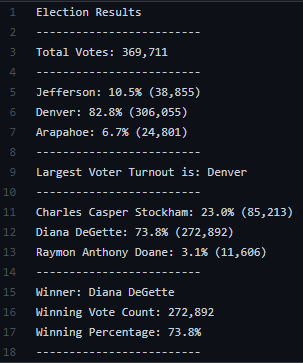

# Election_Analysis
### Overview of Election Audit
The purpose of this Election Audit Analysis is to more closely examine the voter turnout in the specified counties of Arapahoe, Denver, and Jefferson, as well as to tablulate and label the winning candidate.

### Election-Audit Results

1. How many votes were cast in this congressional election?\
A total of 369,711 votes were cast in this election.
2. Which county had the largest number of votes?\
Denver had the most votes, with 82.8% of the total votes cast.
3. Which candidate won the election, what was their vote count, and what was their percentage of the total votes?\
Diana Degette won the election with 73.8% of the votes (272,892 total).

### Election-Audit Summary
This script employs an if-then statement nested in a for loop, which is designed to loop through each line of data and tabulate values based on the parameters set by the analyist. It can be reused with minor changes to audit or tabulate any election, as well as gather the informtion needed from a .csv file in order to provide an analysis. In this case, we have tablulated both the winning candidate (and her willing vote total and percentage), and the county with the largest voter turnout (and its total vote count and percentage of total votes). This analysis clearly illustrates that the candidate who wins Denver is likely to win the election as a whole, as Ms. Degette did. I would recommend focusing future marketing and campaign efforts on that county.
